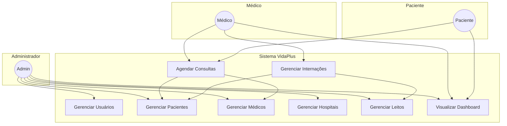

```mermaid
graph TB
    subgraph Sistema VidaPlus
        UC1[Gerenciar Usuários]
        UC2[Gerenciar Pacientes]
        UC3[Gerenciar Médicos]
        UC4[Gerenciar Hospitais]
        UC5[Gerenciar Leitos]
        UC6[Agendar Consultas]
        UC7[Gerenciar Internações]
        UC8[Visualizar Dashboard]
    end

    subgraph Ator1[Administrador]
        A1((Admin))
    end

    subgraph Ator2[Médico]
        A2((Médico))
    end

    subgraph Ator3[Paciente]
        A3((Paciente))
    end

    A1 --> UC1
    A1 --> UC2
    A1 --> UC3
    A1 --> UC4
    A1 --> UC5
    A1 --> UC8

    A2 --> UC6
    A2 --> UC7
    A2 --> UC8

    A3 --> UC6
    A3 --> UC8

    UC6 --> UC2
    UC6 --> UC3
    UC7 --> UC2
    UC7 --> UC5
``` 